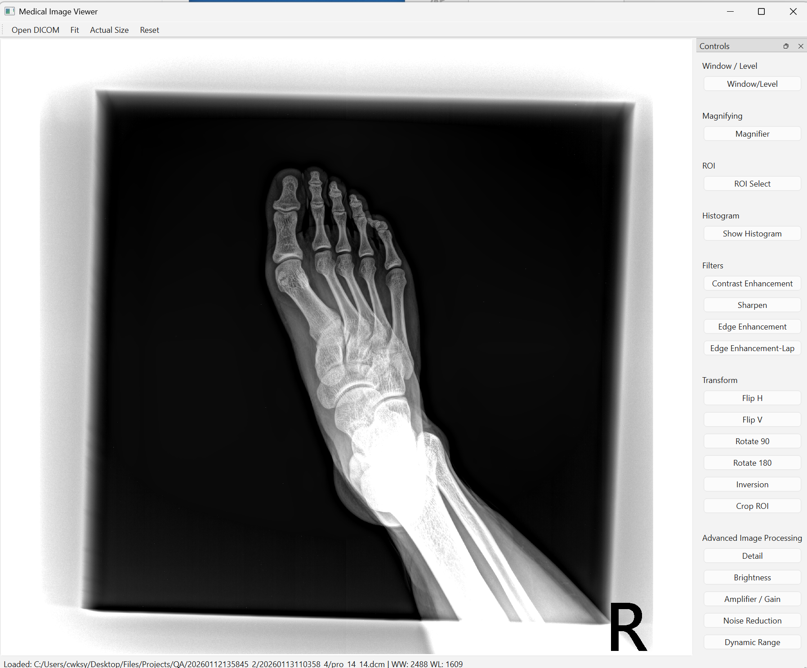
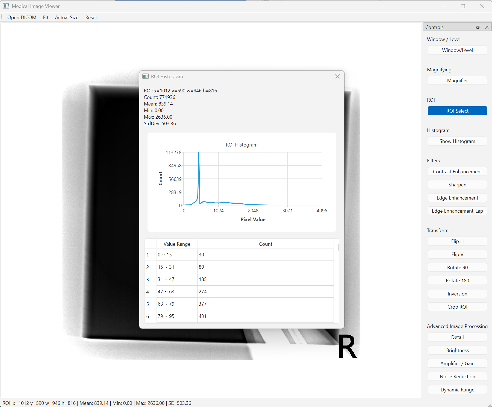

# Medical Image Viewer

## Overview
Medical Image Viewer is a desktop application for viewing and processing DICOM medical images.

This application was developed using Qt6, DCMTK, and OpenCV.

The primary goal of this project was not only to implement image processing features but also to design a maintainable and extensible architecture suitable for medical imaging software.

## Screenshot

### Main Window



### ROI Histogram



## Features

### DICOM Viewer

- Load DICOM Image
- Adjust Window / Level
- Zoom
- Fit to Window
- Actual Size
- Reset

### ROI Analysis

- Select ROI
- Histogram
- Mean
- Standard Deviation
- Pixel Count
 
### Image Processing

- Sharpen
- Edge Enhancement
- CLAHE
- Noise Reduction
- Flip
- Rotate
- Crop
 
## Tech Stack
- C++17
- Qt
- DCMTK
- OpenCV
- CMake
 
## Architecture

The project is divided into independent modules to separate UI, image processing, image state management, and ROI analysis.

Each module has a single responsibility, making the application easier to maintain and extend.

- UI components
- DICOM loading
- Image processing
- ROI analysis
- Image state management

## Design Decisions

To improve maintainability, the project separates image processing, ROI analysis, image state management, and UI components into independent modules.

MainWindow is responsible only for UI composition and event handling, while image-related operations are delegated to dedicated classes. 

This design follows the Single Responsibility Principle (SRP) and reduces coupling between components.

## Refactoring

Initially, MainWindow handled image loading, image state management, ROI analysis, histogram generation, and interaction modes.

As the project grew, these responsibilities were extracted into dedicated classes such as ImageDocument and RoiHistogramDialog.

This refactoring reduced the size of MainWindow and improved maintainability by separating responsibilities.

## Build

### Requirements

- C++17
- CMake 3.19+
- Qt 6.5+
- OpenCV
- DCMTK

### Configure

Before configuring the project, make sure Qt, OpenCV, and DCMTK are installed and discoverable by CMake.

```bash
cmake -S . -B build
```

### Build

```bash
cmake --build build --config Release
```
